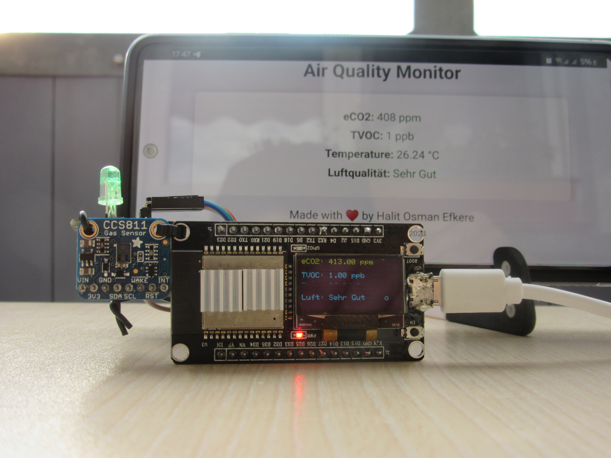

# Air Quality Monitor Using ESP32, CCS811, and OLED Display

This project monitors air quality using an ESP32, a CCS811 sensor for eCO2 and TVOC, and displays the results on an OLED screen. The system also provides a web interface for remote monitoring and signals poor air quality using an onboard LED.

## Air Quality Guidelines Based on Health Standards

The air quality measurements are compared to established health standards from international organizations like the **World Health Organization (WHO)**, the **Environmental Protection Agency (EPA)**, and the **German Federal Environment Agency (UBA)**.

### eCO2 (Carbon Dioxide Equivalent) Ranges
These thresholds for eCO2 are based on WHO guidelines and typical indoor air quality standards:

- **< 600 ppm (Sehr Gut / Very Good)**: Fresh outdoor air levels, ideal for indoor environments.
- **600–1000 ppm (Gut / Good)**: Acceptable indoor air quality; may occur in rooms with some human activity.
- **1000–1500 ppm (Maessig / Moderate)**: Common in enclosed spaces with poor ventilation. Prolonged exposure may cause discomfort or reduced alertness.
- **1500–2000 ppm (Schlecht / Poor)**: Air quality is declining. Complaints of headaches, drowsiness, and fatigue are common.
- **> 2000 ppm (Sehr Schlecht / Very Poor)**: Hazardous air quality. Immediate ventilation is required to avoid serious health effects.

**Reference**: World Health Organization (WHO) – *Air Quality Guidelines Global Update 2005* [link](https://www.who.int/publications/i/item/9789240034228).

### TVOC (Total Volatile Organic Compounds) Ranges
TVOC ranges are based on recommendations from the German Federal Environment Agency (UBA) and typical indoor air quality assessments:

- **< 50 ppb (Sehr Gut / Very Good)**: Excellent air quality. Well-ventilated environments typically fall in this range.
- **50–150 ppb (Gut / Good)**: Good air quality with minimal health risks.
- **150–250 ppb (Maessig / Moderate)**: Some mild discomfort may occur over long-term exposure, especially in sensitive individuals.
- **250–350 ppb (Schlecht / Poor)**: Poor air quality with the potential for irritation of the eyes, nose, and throat.
- **> 350 ppb (Sehr Schlecht / Very Poor)**: Very poor air quality, requiring immediate action to improve ventilation or remove pollutant sources.

**Reference**: Bundesgesundheitsbl - Gesundheitsforsch - Gesundheitsschutz Richtwerte für die Innenraumluft* [link](https://www.umweltbundesamt.de/sites/default/files/medien/pdfs/TVOC.pdf).

---

## Hardware Requirements
- **ESP32**: Microcontroller board with built-in WiFi capabilities.
- **CCS811 Sensor**: For measuring eCO2 and TVOC.
- **SSD1306 OLED Display**: For visualizing sensor data.
- **LED**: Indicator for poor air quality.
- **Aluminum Heat Sink**: Recommended for better heat dissipation from the ESP32 to ensure accurate temperature readings.
  
## Software Requirements
- **Arduino IDE**: To upload the program to the ESP32.
- Required Libraries: 
  - `WiFi.h`, `WebServer.h`, `DNSServer.h`, `Adafruit_GFX.h`, `Adafruit_SSD1306.h`, `Adafruit_CCS811.h`.

---

## Features
- **Real-time Air Quality Monitoring**: Monitors eCO2, TVOC, and temperature.
- **Air Quality Classification**: Evaluates air quality based on established standards.
- **OLED Display**: Real-time display of air quality data.
- **Web Interface**: Access real-time data via a browser using the ESP32’s WiFi.
- **LED Indicator**: Turns on when air quality is poor (Schlecht or Sehr Schlecht).
- **Internal Temperature Monitoring**: Monitors the internal temperature of the ESP32.

---

## Measurement Ranges
### eCO2
- **400–600 ppm**: Sehr Gut (Very Good) – Typical fresh air.
- **600–1000 ppm**: Gut (Good) – Acceptable indoor air quality.
- **1000–1500 ppm**: Maessig (Moderate) – Poorly ventilated room.
- **1500–2000 ppm**: Schlecht (Poor) – Complaints of discomfort.
- **Above 2000 ppm**: Sehr Schlecht (Very Poor) – Hazardous air quality.

**Reference**: World Health Organization (WHO) – *Air Quality Guidelines Global Update 2005* [link](https://www.who.int/publications/i/item/9789240034228).

### TVOC
- **< 50 ppb**: Sehr Gut (Very Good) – Excellent air quality.
- **50–150 ppb**: Gut (Good) – Minimal health risks.
- **150–250 ppb**: Maessig (Moderate) – Potential mild discomfort.
- **250–350 ppb**: Schlecht (Poor) – Potential for irritation.
- **Above 350 ppb**: Sehr Schlecht (Very Poor) – Immediate action required.

**Reference**: Bundesgesundheitsbl - Gesundheitsforsch - Gesundheitsschutz Richtwerte für die Innenraumluft* [link](https://www.umweltbundesamt.de/sites/default/files/medien/pdfs/TVOC.pdf).

---

## Recommendations for Heat Dissipation
To ensure accurate temperature readings, an **aluminum heat sink** is recommended for the ESP32. This helps in dispersing heat generated by the ESP32 during operation, particularly when using WiFi and performing continuous sensor readings. Proper cooling ensures the internal temperature sensor of the ESP32 provides more reliable data.

---

## Installation Instructions

1. **Hardware Setup**: Connect the ESP32, CCS811 sensor, OLED display, and optional aluminum heat sink.
2. **Software Setup**: Install the required libraries in the Arduino IDE and upload the code to the ESP32.
3. **Web Access**: Connect to the ESP32's WiFi network and view real-time air quality data from a browser.

---

## Video Demonstration

For a full video demonstration of this project, check out the YouTube video below:

---

## Photos of the Project

### SETUP

### Webserver View

---
